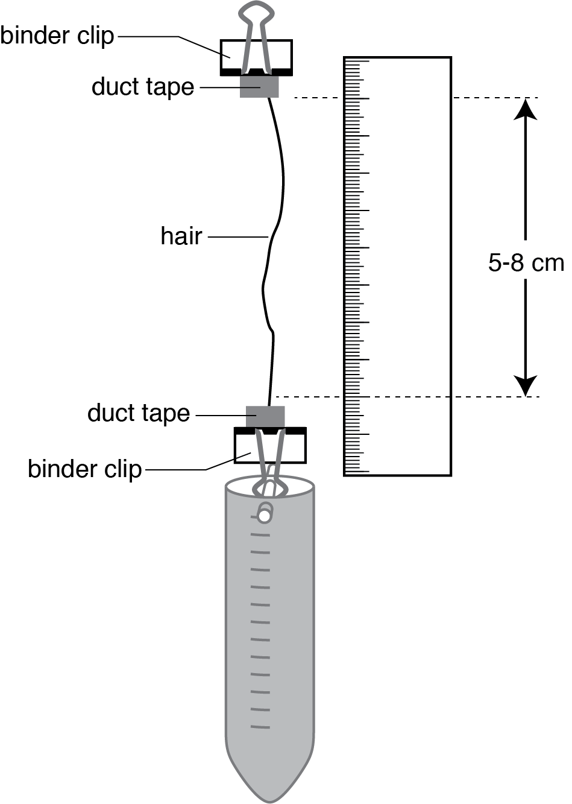

In this activity, we'll measure the stiffness of a strand of hair.  You'll also get some practice in using `R` to analyze data.

# Objectives
* Test the mechanical properties of hair.
* Learn about some of the challenges for understanding biological material properties.
* Start learning how to use `R` for data analysis.

# Materials
1. Two strands of hair, at least 10 cm long
2. Steel balls.  Each ball weighs 1.03 g
3. Duct tape
4. Superglue
5. 50 mL centrifuge tube
6. Two binder clips
7. Data table (`Hair_modulus.csv`)
7. This R notebook (`Hair_modulus.Rmd`)

# Measure hair diameter
1. Take a piece of cardboard and make a 5 x 5cm hole in the center.
2. Tape one piece of hair across the center of the hole so that it is taut and straight.
3. Use binder clips to position the cardboard on a table so that the laser pointer shines directly across the hair towards a wall.
4. Record the wavelength $\lambda$ of the laser (should be printed on the laser pointer) and the distance $D$ between the hair and the wall.
5. Place a ruler below the diffraction pattern and take a picture of it.
6. Carefully measure the distance from the center to starting edge of the first bright band on the left and to the end of the first bright band on the left.
Record the starting and ending distances for each band you can see.  Record the data in the CSV file using Excel. [Hair-diameter.csv](file://Hair-diameter.csv).

# Measure hair elasticity
1.	Working with a partner, collect a strand of hair to test.
2.	Get a small piece of duct tape.  Lay it sticky side up and put a drop of superglue in the middle.  Put the hair in the superglue and fold the duct tape over so that it sticks to itself and the superglue.
3.	Do the same thing with another piece of duct tape, leaving about 5-8 cm of hair in between the two pieces of tape.
4.	Hang the top binder clip off a hook and align a ruler so that zero is lined up with the top piece of duct tape.
5.	Once everything is in position, record the actual resting length of the hair.
6.	Now add steel balls to the centrifuge tube, recording the new length and the amount of weight in the spreadsheet.  You may need to add several of the shot pellets at a time to get a measurable change. Record your data in the CSV file using Excel.  [Hair-data.csv](file://Hair-data.csv)
7.	Note if the hair is creeping (changing length even if you don’t add any more weight) and when/if it breaks.

{width=300px}

# Data

Load in some required libraries.  You can ignore this bit.
```{r message=FALSE, warning=FALSE}
library(ggplot2)
suppressMessages(library(tidyverse))
```

## Hair diameter

We'll estimate the diameter of the hair based on the diffraction pattern from the laser.  The formula is
$$ d = \frac{\lambda m D}{y_{m,avg}} $$
where $\lambda$ is the wavelength of the light from the laser pointer, $m$ is the number of the band you measured (so $m=1$ for the bands closest to the center spot, $m=2$ for the next ones, and so forth), $D$ is the distance from the hair to the wall, and $y_{m,avg}$ is the distance between the center spot and the center of the $m$ band.

This is the wavelength of the laser light, in nanometers.
```{r}
lambda = 630  # nm
```
And the distance between the hair and the wall in meters.
```{r}
D = 2     # m
```

Load in the data.
```{r}
hairdiam <- read.csv('Hair-diameter.csv')
```

Plot the data.
```{r}
qplot(data = hairdiam,
      x = Band, y = Start, color = Side,
      geom = "point")
```

Now calculate the center of each band.  This is just the average between the start and end distance.  We'll use the `mutate` function to add a column to our data table.
```{r}
hairdiam <- mutate(hairdiam, 
                   ymavg = (Start + End)/2)
```

And now compute the hair diameter from each set of bands.  Make sure to convert all lengths into meters.
```{r}
hairdiam <- mutate(hairdiam,
                   diam = ((lambda * 1e-9) * Band * D) / (ymavg * 0.01))
```

Plot the diameter estimates relative to which band and which side you measured.
```{r}
qplot(data=hairdiam,
      x=Band, y=diam / 1e-6, color=Side,
      geom="point")
```

And now get the average diameter
```{r}
diamavg <- mean(hairdiam$diam, na.rm=TRUE)
diamavg
```


## Hair elasticity

Below, we load in the data.
```{r}
hairdata <- read.csv('Hair-data.csv')

hairdata
```
Here length is in cm.

Plot the data
```{r}
qplot(data = hairdata,
      x = NumberOfBalls, y = Length, 
      geom = c("line", "point"))
```

# Analysis

First we convert the number of balls into a weight.

```{r}
ballweight = 0.2         # grams
```

Below, we use the `mutate` function to add another column to our data set.  The first parameter for mutate is the data frame to use.  After that, you can create new columns using the syntax `newcolumn = some function of the old columns`.
```{r}
hairdata <- mutate(hairdata, weight = NumberOfBalls * ballweight)
hairdata
```

Now let's convert the weight and length to stress and strain.  The force $F$ on the hair is $m g$, where $m$ is the mass of the balls and $g = 9.81 m/s^2$ is gravitational acceleration.

Then stress $\sigma$ is the force divided by the cross-sectional area
$$ \sigma = \frac{F}{0.25 \pi d^2}$$
where $d$ is the diameter of the hair (assuming it's circular).

Strain $\epsilon$ is the current length divided by the original resting length (the one with zero balls).

```{r}
g = 9.81                    # m / s^2
```

We'll use `mutate` again to set up the force, and then the stress and strain.
```{r}
hairdata <- mutate(hairdata, 
                   stress = (weight * 1e-3) * g / (0.25 * pi * diamavg),
                   strain = (Length - Length[1]) / Length[1])
```

Plot stress vs strain.
```{r}
qplot(data = hairdata,
      x = strain, y = stress,
      ylab = "Stress (Pa)", xlab = "Strain",
      geom = c("point", "line"))
```

Now estimate the slope of the curve.
```{r}
hairdata <- mutate(hairdata,
                   modulus = (stress - lag(stress)) / (strain - lag(strain)))
```

Plot the modulus
```{r}
qplot(data = hairdata,
      x = strain, y = modulus,
      ylab = "Modulus (Pa)",
      geom = c("point", "line"))
```

